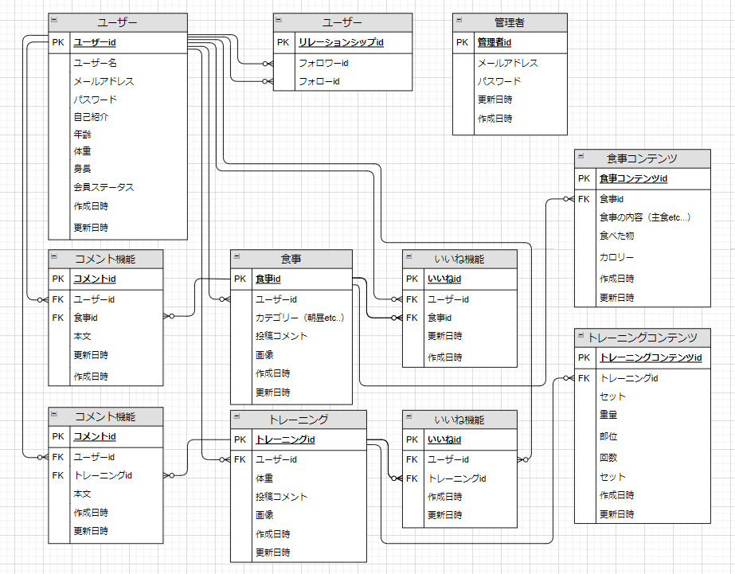
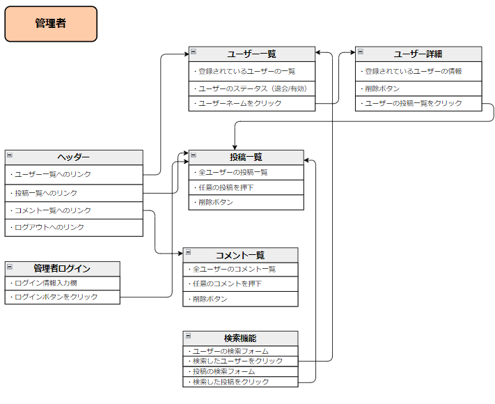
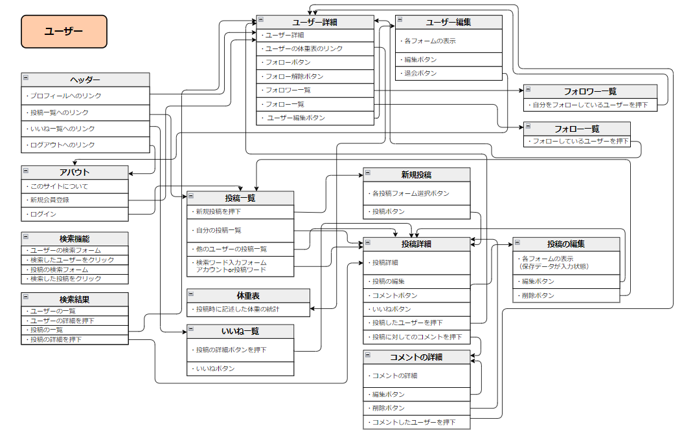

# Track FIT

# サイト概要

**サイトテーマ**

1日の食事やトレーニングの記録を行い、他のユーザーとそれを共有するSNSアプリ

**テーマを選んだ理由**

現在は、SNSでの情報取集が簡単に行える時代です。しかし、その情報はエビデンスに基づいた情報なのか定かではありません。特に、食事やトレーニングの情報は様々なSNSアプリで拡散されており自身で見分ける事がとても難しいと感じます。またその情報が確かなものだと信じ、実践するもなにも効果が得られなかった例も多く、私もその一人です。
自分と同じように、食事やトレーニングの情報取集をするが、効果が得られず時間を無駄にしてほしくないという思いから、それらの記録を行い他のユーザーとそれを共有することでどのユーザーのどんな食事やトレーニングがどんな効果が得られるかを見極めることができる記録アプリあれば便利だと考えました。

**ターゲットユーザ**

・自分のトレーニング方法、食事メニューを共有したいと考えている人

・トレーニングを始めようとしている人、食生活を見直そうと思って居る人

**主な利用シーン**

・どんなトレーニングをしたのか記録するとき

・どんなトレーニングが効果があるか調べたいとき

・どんな食事をしたか記録する時とき

・どんな食事が効果があるか調べたいとき

# 設計書

[アプリケーション詳細設計書](https://docs.google.com/spreadsheets/d/1q7r4B3ejhqvaU0KpxT4WHuzCVSV7AjG7I1rW0ZbGeAA/edit?gid=549108681#gid=549108681)

[テーブル定義書](https://docs.google.com/spreadsheets/d/1ONTZq53YaSc_NtG0sBQArLb6nh5G2qoT4wQEUNIk1gU/edit?gid=1044500859#gid=1044500859)

### 機能一覧
**顧客側**
|機能名|詳細機能|非ログイン時利用不可|
|------|--------|--------------------|
|ログイン機能|メールアドレス、パスワードでログインできる。 ログイン時のみ利用できる機能が利用可能になる。|○|
|ログアウト機能|ログインしている状態からログアウト状態にする。 ログイン時のみ利用できる機能が利用できなくなる。|×|
|投稿機能|食事またはトレーニングの投稿を行なうことができる。 食事またはトレーニングのボタンで切り替えることができる|×︎|
|投稿編集機能|食事またはトレーニングの投稿を編集・削除することができる。|×|
|投稿一覧表示機能|食事またはトレーニングの投稿一覧を表示することができる。 食事またはトレーニングのボタンで切り替えることができる。|×︎|
|いいね機能|顧客の投稿をいいねまたはいいねの解除をすることができる|×|
|いいね一覧機能|自分がいいねした投稿を表示することができる。|×|
|コメント機能|他のの顧客の投稿に対してコメント、コメント削除することができる。|×|
|フォロー フォロアー機能|顧客詳細画面でフォロー、フォロワー一覧ページで フォローまた解除することができる フォロー、フォロワー一覧画面で フォローまた解除することができる|×|
|フォロー フォロアー一覧|フォロー、フォロワーを押すことで一覧表示することができる|×|
|検索機能|顧客、食事、トレーニングの投稿を検索することができる|×|
|ソート機能|食事またはトレーニングの投稿をいいねの昇順、降順に表示することができる|×|
|退会機能|退会手続きをすることができる|×|
|顧客編集機能|登録している情報を変更する事ができる|×|

**管理者側**
|機能名|説明|非ログイン時利用可否|
|------|----|--------------------|
|ログイン機能|メールアドレス、パスワードでログインできる ログイン時のみ利用できる機能が利用できるようになる|×︎|
|ログアウト機能|ログインしている状態からログアウト状態にする ログイン時のみ利用できる機能が利用できなくなる|×|
|顧客投稿一覧表示|顧客の投稿一覧表示、削除することができる|×|
|顧客コメント一覧表示|投稿コメントの一覧表示、削除することができる|×|
|顧客一覧表示機能|顧客の一覧表示、削除することができる|×|
|顧客詳細情報表示機能|顧客のプロフィール、食事、トレーニングの投稿を表示することができる|×|

**使用gem一覧**
|gem|概要|実用理|
|:--:|:--:|:--:|
|gem'cocoon'|複数のデータを一度に追加することができる。|食事内容や、トレーニング内容を複数投稿するため。|
|gem'ransak'|簡易的に検索機能を実装することができる。|ユーザーが他のユーザーや食事、トレーニングの内容を検索するため|

## 開発環境
・OS : Linux(CentOS)

・言語 : HTML,CSS,javaScript,Ruby,SQL

・フレームワーク : Ruby on Rails

・JSライブラリ : JQuery

・IDE : Cloud9

## 使用素材
フリー素材として以下を使用

**PAKUTASO**

ユーザープロフィール画像

(https://www.pakutaso.com/20190101010post-18494.html)

(https://www.pakutaso.com/20240550152post-47555.html)

(https://www.pakutaso.com/20130305086post-2573.html)

(https://www.pakutaso.com/20171049297post-13782.html)

(https://www.pakutaso.com/20161023302post-9391.html)

(https://www.pakutaso.com/20170610165post-12041.html)

食事の投稿画像

(https://www.pakutaso.com/20230904244post-48336.html)

(https://www.pakutaso.com/20210636155post-35014.html)

(https://www.pakutaso.com/20200108016post-25300.html)

(https://www.pakutaso.com/20220732193post-41386.html)

(https://www.pakutaso.com/20191226336post-24584.html)

(https://www.pakutaso.com/20231110314post-42695.html)

(https://www.pakutaso.com/20140459111post-4076.html)

トレーニングの投稿画像

(https://www.pakutaso.com/20130559144post-2778.html)

(https://www.pakutaso.com/20181145324post-17825.html)

(https://www.pakutaso.com/20160549134post-7850.html)

(https://www.pakutaso.com/20230302076post-45856.html)

(https://www.pakutaso.com/20161003299post-9350.html)

(https://www.pakutaso.com/20170648156post-11889.html)

